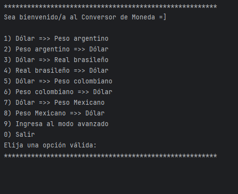
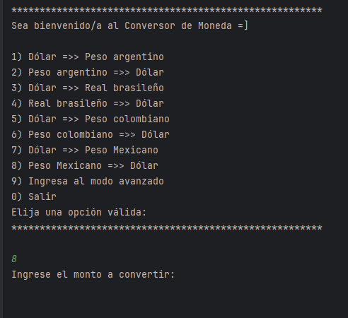
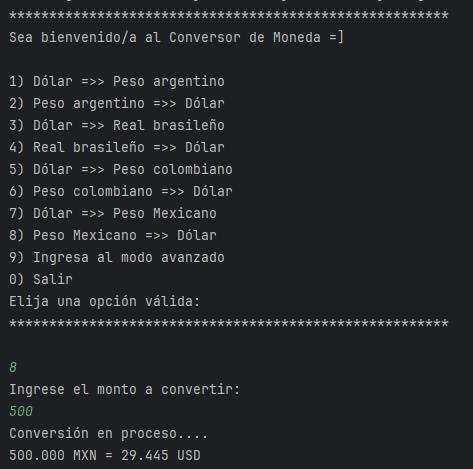
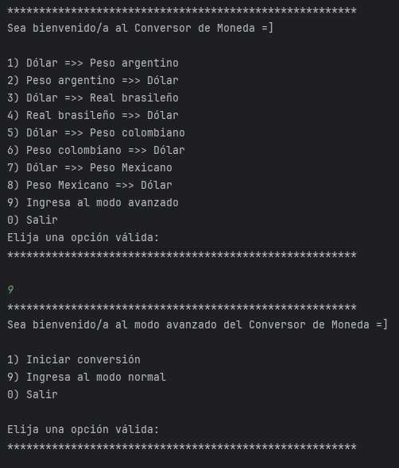
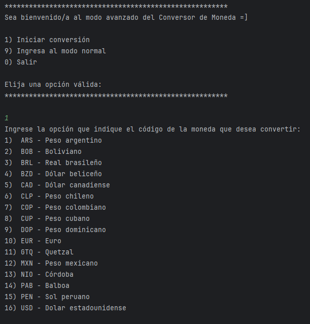
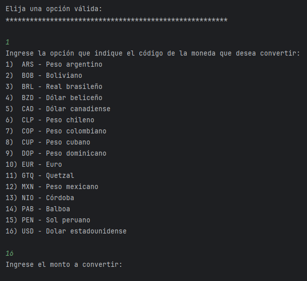
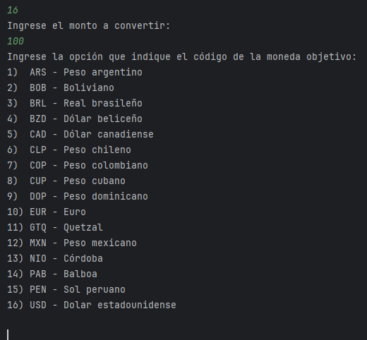
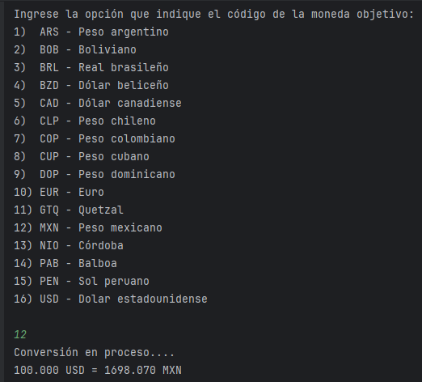
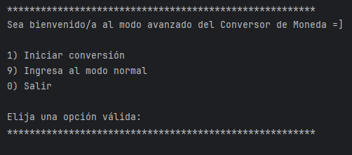
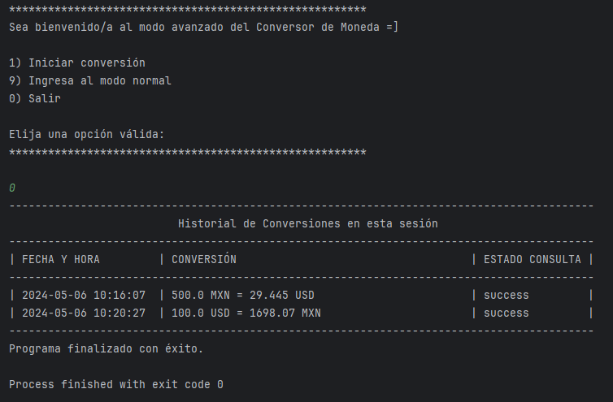

<h1>Conversor de monedas</h1>

Herramienta de conversión de monedas desarrollada en Java empleando ExchangeRate-API . Este proyecto forma parte del programa de desarrollador back-end de Oracle ONE(G6) de Alura Latam.

<h2>Descripción del proyecto</h2>

Cuenta con dos modos de uso, un modo normal y uno avanzado.

La interacción con el usuario es por medio de consola. 

En el modo normal se muestra un menú de conversión de uso frecuente. En el modo avanzado se permite convertir una mayor cantidad de opciones de moneda.

<h2>Características</h2>
<ul>
  <li>Java - <em>Lenguaje base en que se desarrolló la herramienta.</em></li>
  <li>ExchangeRate-API - <em>API que permite la conversión para 161 tipos de monedas diferentes.</em></li>
  <li>Gson - <em>Emplea la librería Gson para acceder a la respuesta de la API</em></li>
  <li>HttpClient, HttpRequest, HttpResponse - <em>Para realizar las peticiones a la API</em></li>
</ul>

<h2>Instalación y ejecución</h2>
<ul>
  <li>Clonar este repositorio en su computadora.</li>
  <li>Abrir el proyecto con su IDE preferido. </li>
  <li>Añadir la biblioteca Gson a las dependencias del proyecto.</li>
  <li>Ejecutar el método "main" de la clase "Main".</li>
  <li>Seguir las instrucciones de la consola. </li>
</ul>

<h2>Guía de uso</h2>

Una vez iniciado el programa, lo primero que se mostrará será un menú de 10 opciones, que incluye las conversiones más frecuentes, una opción para ingresar al modo avanzado y una opción para salir.

Ingresamos por consola la opción que deseemos, para este ejemplo utilizaremos 8.

Una vez ingresada la opción, nos solicitará el monto a convertir, para este ejemplo usaremos 500. Una vez ingresado nos mostrará el resultado de la conversión.

 Una vez terminada la conversión se vuelve a mostrar el menú inicial. Esta vez ingresamos 9 para acceder al modo avanzado, con lo cual se nos mostrará un nuevo menú de 3 opciones. 

 Ingresamos la opción 1 para iniciar la conversión. Nos despliega un nuevo menú con 16 opciones de moneda para convertir.

 Elegimos en este ejemplo la opción 16. Nos solicitará ingresar el monto a convertir. 

Para este ejemplo ingresamos 100. Nuevamente nos mostrará un menú de 16 opciones, pero esta vez para elegir la moneda destino. 

En este ejemplo seleccionamos la opción 12. La conversión inicia y al finalizar nos muestra el resultado.

Una vez finalizada la conversión se vuelve a mostrar el menú avanzado. En este punto podemos elegir continuar convirtiendo, regresar al modo normal o salir de la herramienta.

En cualquiera de los dos menú, al momento de elegir la opción salir, se nos mostrará un historial de las conversiones realizadas durante la sesión activa y posteriormente finalizará el programa.

<h2>Autor</h2>

Antonio Valdez Aguayo

